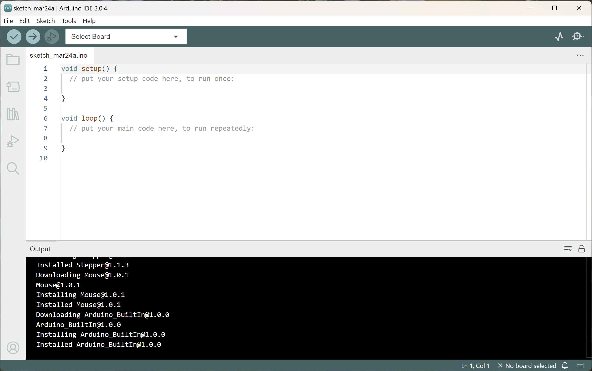

# Build Steps Photos

Here is a sequence of photos showing the building up of a v1.3 eChook board. For each step, solder the components in place, then clip the excess component legs just above the solder joint to keep make the next components easier to place.


Don't forget, we have recorded a video of building a board which may help you with these steps: [View on Youtube](https://www.youtube.com/watch?v=PspD6s5LoBA).


* Start with the resistors - these are the smallest components.


If the resistors aren't labeled, use the[ resistor colour codes](http://www.instructables.com/id/How-to-read-color-codes-from-resistors-1/) or a multimeter to determine their values


Now all the remaining resistors are the same value.

* Ceramic Capacitors and the Diode next


Ceramic Capacitors \(1μF\) - these have 105 printed on them. The first two digits indicate the value, the third digit is the number of zeros following that value, to give the capacitance in pico Farads.

105 translates to $$10 \times10^5$$ pF or 1,000,000pF, 1000 nF or finally, 1μF



**Diode** - The grey end of the diode goes to the end pointed to by the ‘arrow’ diode symbol on the silkscreen.


* Transistor: This looks similar to the hall effect sensors but is larger and has 'BC547' printed on it.  There will be a few mm of leg between the transistor and the PCB.  
* LED: The LED is labelled as PWM on the board as this is the signal it shows by default.


Both the **LED** and **transistor** need to be placed in the correct orientation - the 'D' shape of the component matches the outline on the board.


* Tracopower Voltage Regulator


**Voltage Regulator** is orientation specific.  The dot on the pink face lines up with the square solder point with the pink face to the outside edge of the PCB


* Electrolytic Capacitor \(22μF\)


**Electrolytic Capacitors** are orientation specific. The -ve leg is marked with a grey stripe on the capacitors body and hollow '-' symbols. The PCB indicates which side the +ve leg is with a '+' sign.


* Header Socket for the Arduino and Bluetooth Module
* 8 pin DIP Socket for the Op-Amp


The **DIP Socket** is orientation specific.  There is an indentation on the silk screen image, this lines up with the indentation on the socket.



For larger components with 3+ pins it can be helpful to solder one pin in first then make sure that the component is flat with the PCB. To adjust it, simply melt the solder on the single pin and move the component until you are happy. Now solder the remaining pins.


* Polyfuse
* Connectors

  
All soldering on the PCB is now done. 


**Complete the power on tests** described on the next page **before** plugging in the Arduino, Bluetooth Module and Op-Amp as shown below.



When connecting the Bluetooth module, ensure that it is plugged in the right way round using the silkscreen labels on the PCB and bluetooth module.


The remaining components are fitted to the car itself, as described in the 'Connecting the eChook to the Car' section.



