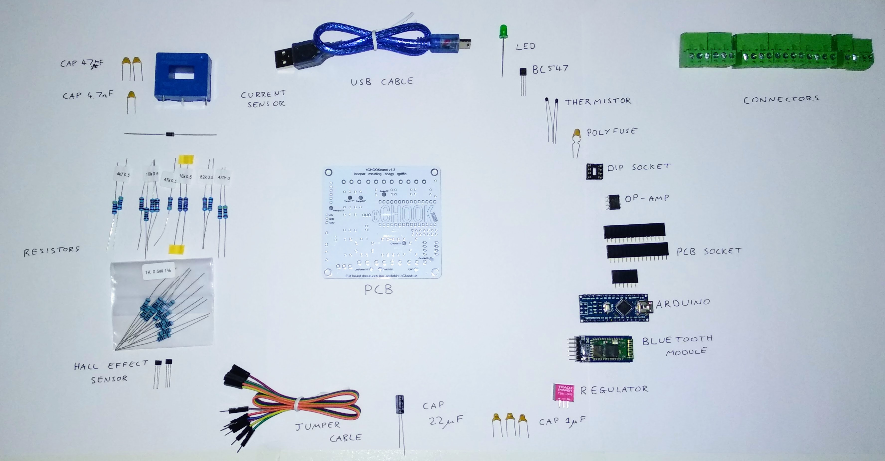

# Required Components \(BOM\)

The eChook nano kit will come with all components required to populate the PCB, and a variety of sensors to plug into it. These are listed in the table below.

| **Quantity** | **Component** | Use |
| :--- | :--- | :--- |
| 1 | Green LED, 5mm | Indicator LED on PCB |
| 1 | BC547 NPN Transistor | Amplification stage of PWM output on PCB |
| 2 | NTC Thermistor 10kΩ@25° | Temp Sensor \(not on PCB\) |
| 1 | Radial Resettable Fuse 0.25A | Over current protection \(Short Circuit\) |
| 1 | 8 Way DIP Socket | Socket for Op-Amp |
| 1 | Microchip MCP6002 Dual Op Amp | Used in differential amplifier for current input |
| 2 | SIL 2.54 Female PCB Socket 15 Hole | Socket for Arduino |
| 1 | SIL 2.54 Female PCB Socket 6 Hole | Socket for Bluetooth Module |
| 1 | Arduino Nano | The Brain of the eChook |
| 1 | HC-05 Bluetooth module | Send data to phone over bluetooth |
| 1 | TRACOPOWER Switching Regulator, 6.5-36V dc Input, 5V Output, 1A | Take 24v from the car and provide a robust 5v to the Arduino |
| 3 | Ceramic Capacitor 1uF | Low Pass filtering on some sensors |
| 1 | Electrolytic Capacitor 22uf 50V | Input voltage smoothing for the regulator |
| 1 | 30cm 6 way Male-Female PCB Jumper Cable | Allows connecting the bluetooth module remotely |
| 2 | Non latching Hall Effect Sensor \(A1101EUA-T\) | Sensor for wheel/motor rpm \(not on PCB\) |
| 12 | 1k Resistor | Protection for Arduino pins |
| 2 | 4k7 Resistor | Input Resistors for current differential amplifier |
| 4 | 10k Resistor | Feedback on Differential amp and pull ups for Thermistors |
| 1 | 47k Resistor | Post amp current filter |
| 2 | 82k Resistor | 24v and 12v Potential Dividers |
| 2 | 16k Resistor | 24v and 12v Potential Dividers |
| 1 | 470r Resistor | Voltage drop for LED |
| 1 | Rectifier Diode, 50V 1A | Reverse Polarity Protection |
| 3 | 4 pin Pluggable Terminal 5.08mm | Connectors |
| 2 | 3 pin Pluggable Terminal 5.08mm | Connectors |
| 1 | 2 pin Pluggable Terminal 5.08mm | Connectors |
| 1 | 3 pin Pluggable Terminal 3.81mm | Connectors |
| 1 | LEM HAIS Series Open Loop Current Sensor, ±150A | Current Sensor \(not on PCB\) |
| 2 | 47nF Ceramic Capacitor 50 V | Smoothing Capacitors for current sensor  \(not on PCB\) |
| 1 | 4.7nF Ceramic Capacitor 50 V | Smoothing Capacitors for current sensor \(not on PCB\) |

Photograph of all components in kit:

## Extra Components:

Magnets are required to fit to the wheel and motor shaft in order to trigger the hall effect sensors. It's recommended to use 3x1mm or larger Neodymium puck magnets. These are available for not much money on eBay.

Wire will be required to connect the remote sensors to the connectors.

## Tools Required:

* Soldering Iron and Solder
* Snips

