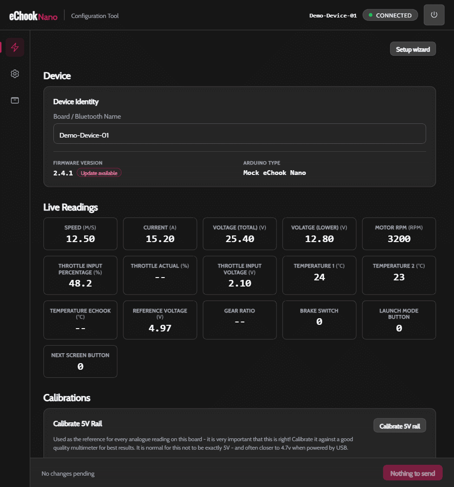
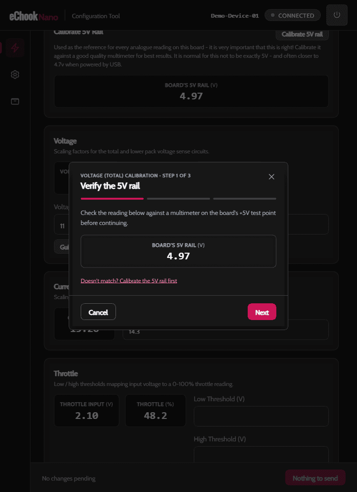

# Calibrating the eChook

From the default calibration values, a correctly assembled eChook board will give reasonably accurate data. This section takes you through calibrating each input in turn. Each calibration routine involves taking some readings with external equipment - generally a multimeter - some simple calculations, and updating a calibration variable on your eChook Nano.

On earlier versions of the board (with Arduino code below version 2.0, released in Jan 2024), updating the calibration requires editing the calibration.h file, then reflashing the Arduino with the new values. Boards running V2 (Arduino code version 2.0 or later) can be connected to a computer, and the calibrations can be read and updated via a web interface.

Some signals require some calibration input unique to your car, such as wheel speed, which relies on knowing your exact wheel circumference and number of pickup magnets fitted. (NOTE: Arduino code V2.5+ needs to have a single magnet)

The signals that will give acceptable readings, but benefit most from extra calibration are the analogue readings - Current, voltages and temperatures.&#x20;

## Choose your calibration path

* **V2 (Arduino code version 2.0 or later):** use the web interface at `configure.echook.uk`.
* **Legacy (Arduino code below version 2.0):** update values in `calibration.h`, then reflash the Arduino.

### Calibration Web Interface

The calibration web interface has recently been redesigned, and is available at [configure.echook.uk](https://configure.echook.uk). Please note it requires either Chrome or Edge desktop browsers. There is no mobile browser support.

Use the web interface in this order:

1. Unplug the Bluetooth module (unless you have an Arduino Nano Every) and connect your eChook to your computer.
2. Navigate to the [configuration webapp](https://configure.echook.uk) and click connect.
3. In the browser menu, select the eChook's COM port from the list and press connect.
4. After a few seconds, the Device screen below should open, showing every live reading alongside its calibration fields.

<figure><figcaption></figcaption></figure>

5. On the first run through, use the setup wizard to get the main required settings in place.
6. To update other calibrations enter the new number in the corresponding box. Any changes are highlighted, and the bottom-right button will reflect how many changes you have entered from the configuration saved on the eChook.
7. To save the changes to the eChook, press the bottom-right button. These will be reflected immediately in the values being read out on screen.
8. Once you have a configuration you are happy with, open the backup icon in the left-hand sidebar and use **Download backup** to save a `.ecb` file. Keep this somewhere safe - you can restore it from the same screen later if needed.

For voltage and wheel/motor speed, look for the **Guided calibration** button next to the relevant field. It walks you through checking a multimeter reading against the board and works out the scaling factor for you, rather than you having to calculate it by hand.

<figure><figcaption>
Guided calibration - walks you through each step, multimeter reading included
</figcaption></figure>

The next few pages describe the legacy `calibration.h` workflow, and the manual calculation behind each calibration value. For V2 (Arduino code version 2.0 or later), a guided calibration button does the maths for you where available - the following pages are still worth a skim to understand what's being calibrated and why.

### Issues?

If you hit any issues, please feed back on the forum, or via email to info@echook.uk.
