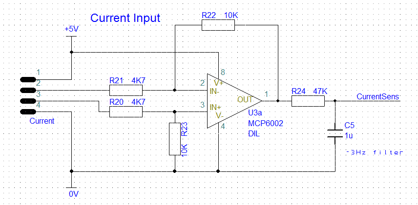

# Current Input

This is the most complex input circuit on the eChook, but once broken down is still pretty simple. The main component above is an Operational Amplifier (op-amp). More information on op-amps can be found [here](http://www.electronics-tutorials.ws/opamp/opamp\_1.html) or through google.

The op-amp above is configured to be a differential amplifier; the output is the voltage difference between the two inputs, multiplied by a gain.

The gain is set by the feedback resistors (R22 and R23) and the input resistors (R20 and R21). In this circuit both feedback resistors are equal, and both input resistors are equal, so the gain can be calculated as below, where V2 and V3 are the voltages on connector pins 2 and 3 in the schematic.

$$
V_{out} = (R_{22}/R_{20})*(V_3 - V_2)
$$

More information on solving differential amplifiers can be found [here](http://masteringelectronicsdesign.com/solving-the-differential-amplifier-part-1/).

At the current sensors maximum calibrated current (50A) the difference between the reference and sense outputs will be about 2.5V. The gain doubles this to the maximum voltage readable by the arduino, giving a higher sensitivity to the current readings.

## Filter

The current signal is very noisy, primarily as small current spikes are created each time the motor brushes make a new connection with the coils. R24 and C5 create a RC low pass filter with a 3Hz cutoff frequency to remove these high frequency spikes and smooth the signal.
