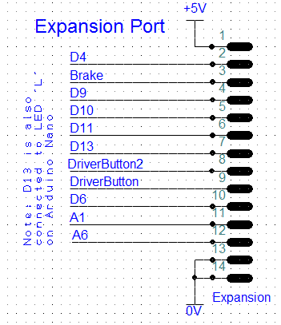

# Expansion Port

While not a circuit as such, if you want to expand the eChook board at all you'll be connecting through this port. It exposes the pins on the Arduino that are unused by default - 6 digital I/O pins and 2 Analogue Input pins. Note that A1 can be used for digital IO but due to internal wiring in the Arduino, A6 is _only_ an analogue input.

On the PCB the expansion port pads are counted anticlockwise from the square pad. Pins 1-7 down one side, then 8-14 back up the other.

