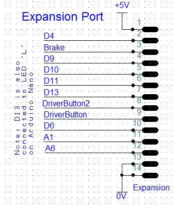

# Expansion Port

This is not a circuit block, but it is the connection point for expanding the eChook board. It exposes Arduino pins that are unused by default: 6 digital I/O pins and 2 analogue input pins. Note that A1 can be used for digital I/O, but due to internal Arduino wiring, A6 is _only_ an analogue input.

On the PCB, the expansion port pads are counted anticlockwise from the square pad: pins 1-7 down one side, then 8-14 back up the other.
