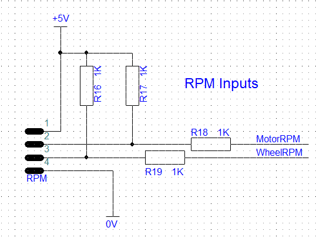

# RPM Inputs

The RPM Connector provides 5V and GND for the hall effect sensors, then takes two signals, one from each sensor.

The hall effect sensors act as switches. When no magnet is detected, there is no connection between the signal pin and ground. When a magnet is sensed, the signal pin connects to ground. To turn this into a signal readable by the arduino, we need to pull the signal leg up to 5V when there is no connection, and allow it to drop to 0V when the magnet is sensed. R16 and R17 are pull up resistors that do this. R18 and R19 are protection resistors to prevent too much current reaching the Arduino in the event of a wiring mistake.
