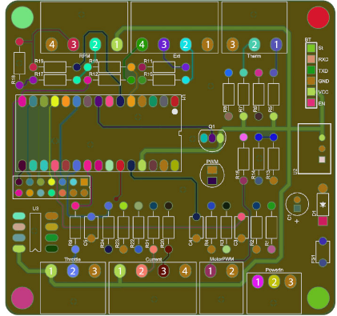

# Connecting the eChook to the Car

Now that the board is sending data to the phone, it needs to have some useful data to send. All of the external connections to the board go through pluggable terminal connectors. This makes it easy to wire into the vehicle’s harness with the screw terminals, and makes the board easy to remove from the car if necessary.


There is a post with some guidance to building a Greenpower car wiring harness on the eChook forum [here](http://echook.boards.net/thread/26).


The diagram below shows the external interfaces to the board numbered, with details on each connection in the table. When connecting the sensors to the board, use this to identify which wire goes where!


 Label the connectors on the harness side to make it easier to identify them in future.


## Connector Pin Out

| Connector | Pin | Signal | Use |
| :--- | :--- | :--- | :--- |
| Power In | 3 | Ground. This needs to be connected to the -ve battery commonly through the vehicle's chassis | Main grounding point for the board. |
|  | 2 | 12v. Connects to the +ve terminal of the lower battery | Monitoring the lower battery voltage. Allows calculation of the two individual battery voltages. |
|  | 1 | 24V input from the batteries. | Power to the board and 24V monitoring |
| Motor PWM | 2 | Ground reference | Ground for PWM line |
|  | 1 | 5V PWM Output | A PWM output. Could control the drive motor, or a fan etc. |
| RPM | 4 | Ground reference | Ground for Hall Effect Sensors |
|  | 3 | Wheel RPM - Pulsed 5V input from hall effect sensor | Signal from wheel hall effect sensor |
|  | 2 | Motor RPM - Pulsed 5V input from hall effect sensor | Signal from motor hall effect sensor |
|  | 1 | 5v Supply | 5V supply for the Hall Effect Sensors |
| Therm | 3 | Ground reference | Ground connection for thermistors |
|  | 2 | Temp 2 - Line to thermistor | Connection to thermistor 2. Thermistor connects between here and ground |
|  | 1 | Temp 1 - Line to thermistor | Connection to thermistor 1. Thermistor connects between here and ground |
| Throttle | 3 | Ground reference | Ground reference for throttle |
|  | 2 | 0-5v throttle input | Analogue input for a variable throttle, or digital for a push button. Needed for throttle logging |
|  | 1 | 5v Supply | 5v supply for the throttle |
| Ext Buttons | 4 | Button 2 Active LOW digital Input | Input for 'Switch Screen' button |
|  | 3 | Button 1 Active LOW digital Input | Input for 'Launch Mode' button needed for lap counting |
|  | 2 | Brake active Low or High \(Code Dependant\) digital input | Input from switch on brake lever, intended for logging brake use |
|  | 1 | Ground reference | Ground reference for buttons |
| Current | 4 | Ground reference | Ground reference for current sensor |
|  | 3 | Current Sensing Analogue input, 0-5v | Input from Current Sense pin |
|  | 2 | Current Reference Analogue input, 0-5v | Input from current sensor reference pin |
|  | 1 | 5v Supply | 5V to current sensor |

