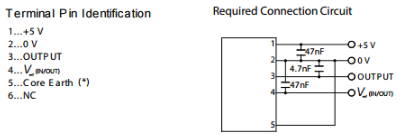
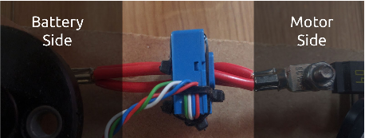

# Current Sensor

Current is probably the most useful data to have on a greenpower car as it gives the best indication of how quickly the batteries are being discharged.

The current sensor needs two 47nF capacitors and one 4.7nf capacitor \(also not supplied with the kit\) soldered to it, as close to the pins as possible as shown in the[ datasheet](http://docs-europe.electrocomponents.com/webdocs/142e/0900766b8142e844.pdf) diagram below:

This sensor needs to be placed around the main 24V cable from the battery. A convenient location is often next to the circuit breaker. The orientation of this sensor is important; if it is the wrong way around it will not read a current. The correct orientation is shown below.

Now connect the 5V, 0V, Output and Vref to the eChook board.

