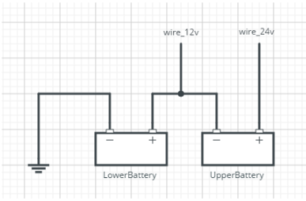

# Power and Voltage

## Power to the Board - 24V and GND 

To power the board in the car, connect the GND pin on the ‘Power In’ socket to ground, and the +24v pin to the 24v battery supply on the car.&#x20;

There is no need for an external 5V supply.&#x20;

For safety (and to comply with Greenpower regulations), it is suggested to take power from after the isolator switch and the board must have it’s own fuse, located as close to the battery in the harness as feasible. nominally 5A, although 1A is more than adequate.

The 24V input is logged by the eChook as 24v battery voltage.

## 12v Input

This monitors the voltage of the ‘lower’ battery, allowing the system to monitor and log the voltages of both 12v batteries. This will show if one of the batteries is in a worse condition than the other.

The 12v monitoring requires a wire from the positive terminal of the lower battery, as shown by the wire\_12V label in the diagram below:

As this is a wire from the battery it requires a fuse of it’s own, a low value (<1A) is recommended but 5A is sufficient. As this is simply a reference wire, no current will be drawn through it, so a thin wire can be used, however **ensure that the wire is able to carry a higher current than the fuse that it is protected by**.

## 5v Outputs on other connectors

All 5v connections on the board are **Outputs Only** and will be connected as needed.&#x20;

* **V1.x boards -** all 5v outputs are connected to the same voltage rail, and a short circuit on one of these outputs will pull the whole eChook 5V rail to ground. It will not cause lasting damage, but will shut down the board until the short circuit is fixed.
* **V2.x boards -** Each 5v output has individual overcurrent protection. (Throttle, Current Sensor, RPM Sensors, Bluetooth Module, and expansion header). Each 5V output is individually limited to 300mA (1.5W), and if too much current is drawn, a red fault LED, marked with an '**!**', will illuminate next to the relevant connection. The rest of the board will continue to operate without interruption.

**CAUTION: Applying a higher voltage to the 5v rail&#x20;**_**will**_**&#x20;cause damage to the eChook board and the Arduino Nano.**
