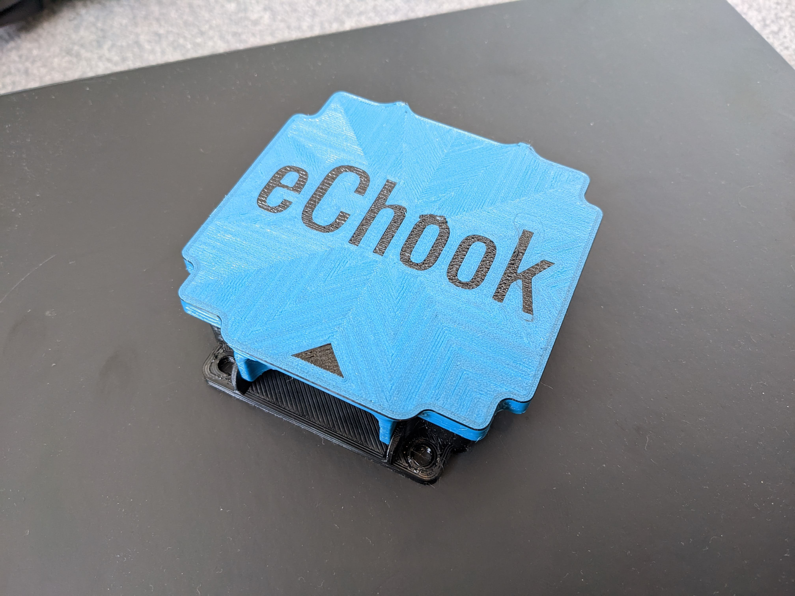

# eChook Accessories

I'll add to this collection over time, all models will be uploaded to Printables for anyone to print, and for those without printers will also be available to buy at [shop.echook.uk](https://shop.echook.uk) (Currently UK only, feel free to get in touch for international purchases)

If anyone has eChook, or just general Greenpower related models they would like to share I've started a 'collection' on Printables: [Greenpower / eChook Models Collection](https://www.printables.com/social/456424-echook/collections/503732). I will be adding to this over time, but if anyone wants to contribute, send me the link to your model on Printables and I'll gladly add it!

### eChook nano Case &#x20;

<figure><figcaption></figcaption></figure>

The first problem to solve was reliably and neatly mounting the eChook to the car. This case provides convenient M5 mounting points, a hinged lid - which when closed ensures the connectors can't pull out, and internal mounting for the Bluetooth module.

To keep the overall size down there are a couple iof modifications needed to the eChook board for it to fit - the wires for the Bluetooth module need to be soldered directly to the board, rather than on the header connector, and the ICSP header (6 pins sticking up) on the Arduino need to be removed - either de-soldered or snipped.

For more information see the listing at [shop.echook.uk](https://shop.echook.uk/?product=echook-nano-v1-3-case), and for print files go to [printables.com](https://www.printables.com/model/401059-echook-nano-gpt-case)
