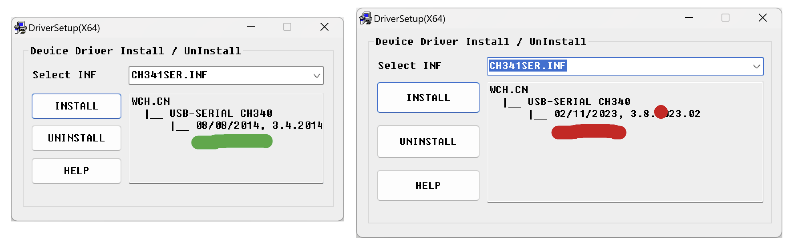

# Arduino Drivers

New kits come with a genuine Arduino Nano Every, earlier kits come with an Arduino compatible Nano clone. The driver installation for each is different - select the correct one below.

<figure><figcaption></figcaption></figure>



Within the Arduino IDE, go to the Tools menu, then Boards, then Boards Manager.

In the Boards Manager, search for megaAVR and install it.

<figure><figcaption>
Arduino megaAVR Boards installed
</figcaption></figure>

All done - continue to the next page.



The Arduino Compatible Nano uses a different USB Serial interface and requires a driver to be installed that isn't included with the Arduino IDE.

Sparkfun have written an excellent installation guide, linked below. Ensure you download the drivers directly from sparkfun, not via the WCH website. There is a bug in the newer (2019+) version of the drivers from the WCH Website.



Alternatively, download the drivers directly (still via sparkfun) [here.](https://cdn.sparkfun.com/assets/learn\_tutorials/8/4/4/CH341SER.EXE)

During the install process, check the driver date - the 2014 drivers work, later ones have been known to cause issues when uploading code to the Arduino.

<figure><figcaption>
Left: Good 2014 drivers.                                                      Right: Buggy later drivers.
</figcaption></figure>

Once drivers are installed continue to the next page.



