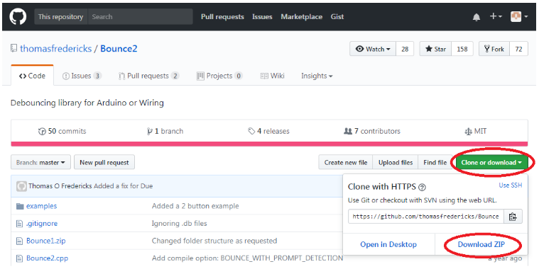
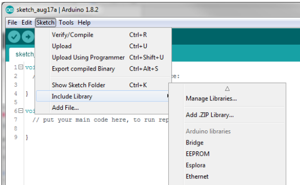

# Download the eChook Arduino Code

There are two aspects to the eChook code - the code itself, and any code libraries that the main code references. The eChook code is dependant on one library called ‘Bounce2’ which is used to debounce the switch inputs.

## Downloading Libraries

Download the Bounce2 library from [here](https://github.com/thomasfredericks/Bounce2):

Now back in the Arduino IDE go to Sketches>Include Library> Add .ZIP and select the file you have just downloaded.

The message bar at the bottom will confirm the library has been added:

All Done.

## Downloading the eChook Code

Just like the library just installed, the eChook code is hosted on github [here](https://github.com/eChook/eChook-Arduino-Nano). Download it and extract it to a suitable working directory, eg. …\My Documents\eChook.
