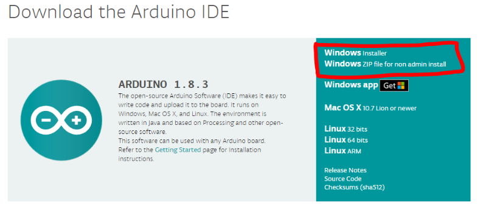
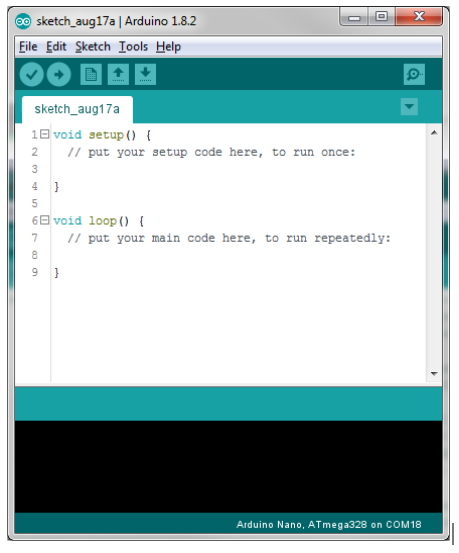

# Install Arduino IDE

First install the Arduino IDE. IDE stands for Integrated Development Environment and is the software you use to write code for the Arduino and to upload it to the Arduino. The Arduino IDE is available from [here](https://www.arduino.cc/en/Main/Software). If you already have the IDE installed, please make sure it is a recent version or you may encounter compiler errors.

Download and install the IDE. Once installed, run the program. It should look like this:

Next install the drivers for 

