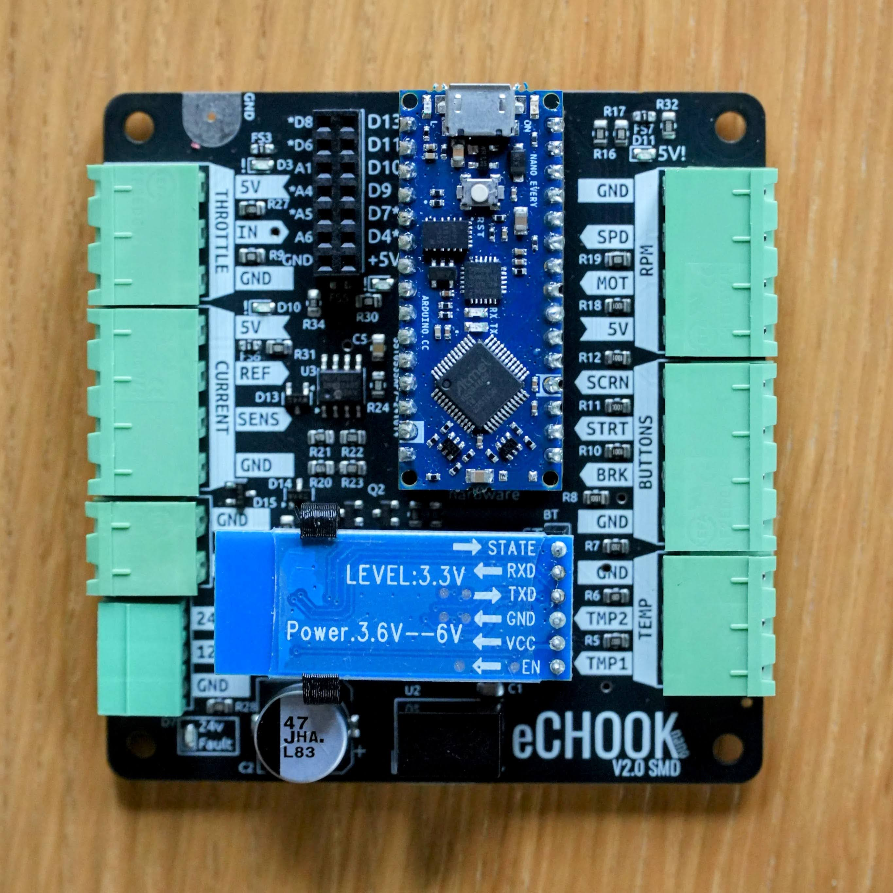
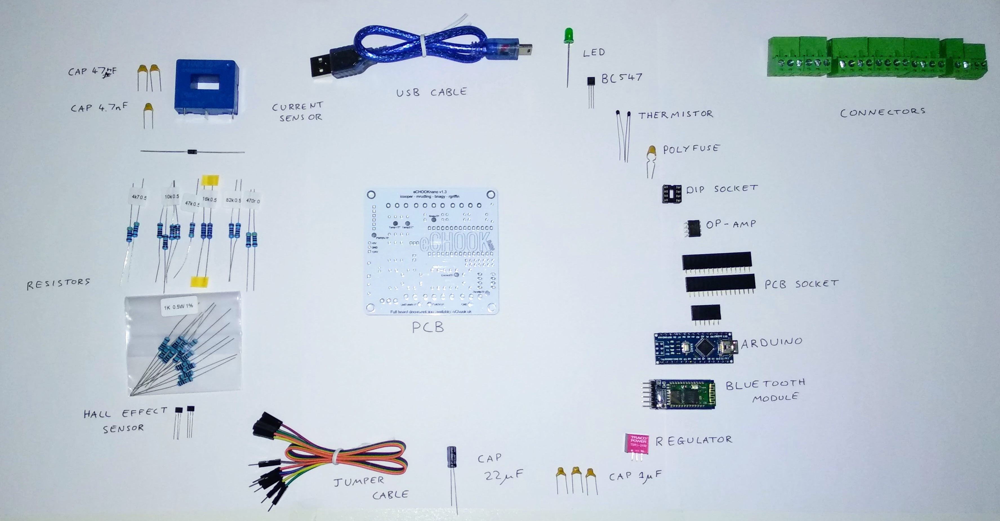

# The eChook Nano Kit

Greenpower sell an eChook Nano kit that contains all the hardware and sensors needed to get eChook telemetry running on a Greenpower car. The Android App and Live Data website are free to use, no kit purchase necessary.

### eChook Nano V2 SMD

From December 2024, V2 of the eChook Nano kits are being sold by Greenpower. While there is still assembly and soldering required for sensors, the main board comes pre-assembled. There is a blog post going into more details of the changes [here](https://shop.echook.uk/?p=444).

<figure><figcaption></figcaption></figure>

This kit contains a fully assembled eChook board, and Arduino Nano Every and Bluetooth module. It also contains PCBs for the current sensor and hall effect (magnet) sensors that require some assembly.

The move to smaller surface mount components and machine assembled boards has allowed a number of improvements, including better labelling of connections on the board, more protective circuitry - if any 5V output is short circuited in the harness it will self isolate, allowing any other sensors and the eChook to remain functional, transient voltages are better supressed and all inputs are now 30v tolerant.

### eChook Nano V1.x

The original eChook  is a fully DIY kit containing of the eChook PCB, all components required to populate the PCB as well as sensors for Current, Temperature (x2) and Rotation (Wheel and motor shaft).

This kit is no longer available to purchase, but the individual PCBs are - see below.

 (1).png>)  (1).png>)

### DIYing the eChook Nano v1.x

If you want to source the components yourself, the bare eChook nano GPT board is available from the eChook shop [here](https://shop.echook.uk). The listing includes links to the full Bill of Materials needed for assembly.

If you want to go totally DIY, or tweak the PCB to your own requirements, the schematics and PCB layouts are Open Sourced and available on [GitHub](https://github.com/eChook/eChook-Nano-PCB).

### V1.x Kit Contents:

<table data-header-hidden><thead><tr><th>Quantity</th><th width="185.33333333333331">Component</th><th>Use</th></tr></thead><tbody><tr><td><strong>Quantity</strong></td><td><strong>Component</strong></td><td><strong>Use</strong></td></tr><tr><td>1</td><td>eChook nano PCB</td><td></td></tr><tr><td>1</td><td>470r Resistor</td><td>Voltage drop for LED</td></tr><tr><td>12</td><td>1k Resistor</td><td>Protection for Arduino pins</td></tr><tr><td>2</td><td>4k7 Resistor</td><td>Input Resistors for current differential amplifier</td></tr><tr><td>4</td><td>10k Resistor</td><td>Feedback on Differential amp and pull ups for Thermistors</td></tr><tr><td>2</td><td>16k Resistor</td><td>24v and 12v Potential Dividers</td></tr><tr><td>1</td><td>47k Resistor</td><td>Post amp current filter</td></tr><tr><td>2</td><td>82k Resistor</td><td>24v and 12v Potential Dividers</td></tr><tr><td>1</td><td>Green LED, 5mm</td><td>Indicator LED on PCB</td></tr><tr><td>1</td><td>BC547 NPN Transistor</td><td>Amplification stage of PWM output on PCB</td></tr><tr><td>3</td><td>Ceramic Capacitor 1uF</td><td>Low Pass filtering on some sensors</td></tr><tr><td>1</td><td>22uF 50v Electrolytic Capacitor</td><td>Input voltage smoothing for the regulator</td></tr><tr><td>2</td><td>47nF Ceramic Capacitor</td><td>Smoothing Capacitors for current sensor  (not on PCB)</td></tr><tr><td>1</td><td>4.7nF Ceramic Capacitor</td><td>Smoothing Capacitors for current sensor (not on PCB)</td></tr><tr><td>1</td><td>0.25A Radial Resettable Fuse </td><td>Over current protection (Short Circuit)</td></tr><tr><td>1</td><td>8 Way DIP Socket</td><td>Socket for Op-Amp</td></tr><tr><td>1</td><td>Microchip MCP6002 Dual Op Amp</td><td>Used in differential amplifier for current input</td></tr><tr><td>2</td><td>15 way SIL 2.54mm Female PCB Socket</td><td>Socket for Arduino</td></tr><tr><td>1</td><td>6 way SIL 2.54mm Female PCB Socket</td><td>Socket for Bluetooth Module</td></tr><tr><td>1</td><td>5v 1A Voltage Regulator (Tracopower TSR 1-2450) </td><td>Take 24v from the car and provide a robust 5v to the Arduino</td></tr><tr><td>1</td><td>Rectifier Diode, 50V 1A</td><td>Reverse Polarity Protection</td></tr><tr><td>2</td><td>NTC Thermistor 10kΩ@25°</td><td>Temp Sensor (not on PCB)</td></tr><tr><td>2</td><td>Hall Effect Sensor (A1101EUA-T)</td><td>Sensor for wheel/motor rpm (not on PCB)</td></tr><tr><td>1</td><td>Current Sensor (LEM HAIS 50p)</td><td>Senses current in the 24v cable from the battery.</td></tr><tr><td>3</td><td>4 pin Pluggable Terminal 5.08mm</td><td>Connectors</td></tr><tr><td>2</td><td>3 pin Pluggable Terminal 5.08mm</td><td>Connectors</td></tr><tr><td>1</td><td>2 pin Pluggable Terminal 5.08mm</td><td>Connectors</td></tr><tr><td>1</td><td>3 pin Pluggable Terminal 3.81mm</td><td>Connectors</td></tr><tr><td>1</td><td>Arduino Nano</td><td>The Brain of the eChook</td></tr><tr><td>1</td><td>USB Cable for Arduino</td><td>Connect Arduino to PC</td></tr><tr><td>1</td><td>HC-05 Bluetooth module</td><td>Send data to phone over bluetooth</td></tr><tr><td>1</td><td>6 way Male-Female PCB Jumper Cable (Dupont Connectors)</td><td>Allows connecting the bluetooth module remotely</td></tr><tr><td>8 </td><td>Neodymium Puck Magnets</td><td>Place on hub and motor shaft to trigger hall effect sensors</td></tr></tbody></table>

## Tools and Consumables Required

Some tools and consumables will be required to build the kit and integrate the sensors to the car:

* Soldering Iron and Solder
* Solder Sucker or solder wick (handy correcting any build errors)
* Wire Snips
* Small flathead screwdriver&#x20;
* Multimeter
* Wire for connecting sensors remote to the board

