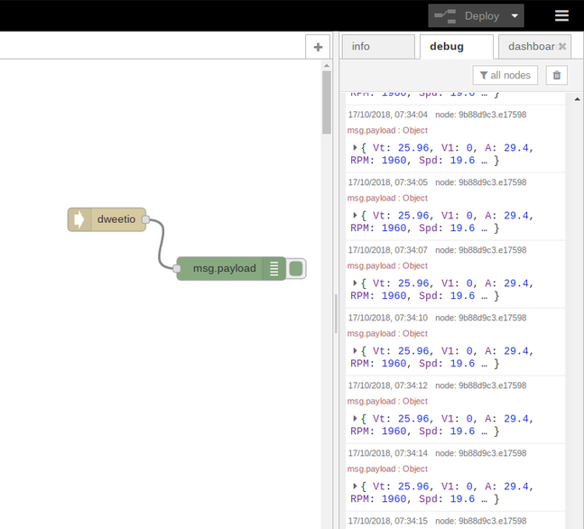

# Node-Red Integration


This page assumes a knowledge of Node-Red and Javascript. If you are familiar with Node-Red then the eChook is simple to integrate. If you've not used it before, best path would be to go to [nodered.org](https://nodered.org/) or google to get started and return to this once you're up and running.


The data send to dweet.io can be accessed from lots of other systems. One that might be of particular interest to Greenpower teams is Node-Red. This is a scratch style, drag and drop programming tool that comes pre-installed on Raspberry Pi's but can be installed \(with varying difficulty\) on all popular operating systems.

Node Red can be used to capture the dweet.io data, perform any calculations on it, and even create your own dashboard to present the data as you want. You will need to add a dweet.io plugin to the palette. This provides you with a dweet.io input node. Configure this with your 'thing name' and it will output all the data being sent from your phone.

Check out the node-red getting started guide here: [https://nodered.org/docs/getting-started/](https://nodered.org/docs/getting-started/)

The image below shows how simple it is to get the uploaded dweet data with just two nodes - dweet node to read it in, and in this case a debug node to print it out to the screen:

